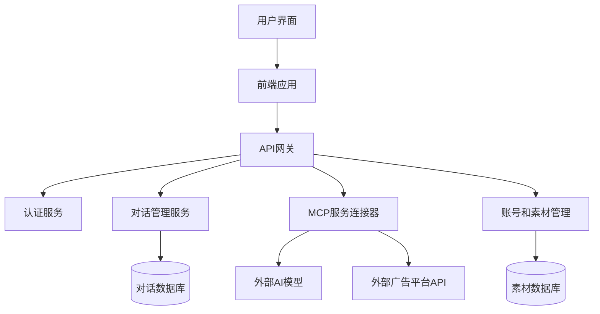

# 广告投放平台AI助手设计方案

## 项目概述

本项目旨在设计一个PC端的AI助手系统，专为广告投放平台打造。该系统将允许用户通过AI聊天对话获取广告数据分析和优化建议，支持选择不同的MCP服务，管理多个广告账号和素材，并能够保存历史对话记录。

### 核心功能需求

1. AI聊天对话界面
2. 可选择不同的MCP服务
3. 多账号管理（广告账号、素材、帖子等）
4. 历史对话记录管理
5. 上下文对话限制可视化
6. 多种大模型选择

## 设计理念

采用现代简约风格，注重用户体验，界面清晰直观，适合不同技术水平的用户。设计遵循以下原则：
- 简洁而不简单，功能强大但不复杂
- 视觉层次分明，重点突出
- 操作流程直观，减少学习成本
- 响应式设计，适应不同屏幕尺寸

## 技术栈选择

### 前端
- **框架**: React 18 + TypeScript
- **UI组件库**: Ant Design Pro
- **状态管理**: Redux Toolkit
- **数据获取**: React Query
- **样式解决方案**: Styled Components
- **图表库**: ECharts/D3.js

### 后端
- **框架**: Node.js + Express/NestJS
- **数据库**: MongoDB (对话历史和用户数据)
- **缓存**: Redis (缓存和会话管理)
- **消息队列**: RabbitMQ (处理异步任务)

## 系统架构

## 高保真原型设计

### 1. 主界面/仪表盘

#### 布局设计
- 顶部导航栏：logo、搜索框、通知、用户头像、设置
- 左侧边栏：主要功能导航（对话、素材库、账号管理、历史记录、设置）
- 中央区域：
  - 欢迎区域（个性化欢迎语、日期和天气）
  - 最近对话卡片（3-5个最近对话）
  - 广告指标概览卡片（关键指标可视化）
  - 待处理任务卡片（待审核创意、优化建议）
  - 快速操作卡片（新建对话、上传素材等）

#### 视觉设计
- **配色方案**: 
  - 主色: #1890ff (蓝色)
  - 辅助色: #52c41a (绿色), #faad14 (黄色), #f5222d (红色)
  - 中性色: #ffffff, #f0f2f5, #d9d9d9, #8c8c8c, #262626
- **字体**: SF Pro Display / 微软雅黑
- **卡片样式**: 圆角8px，阴影，内边距24px

### 2. AI聊天对话界面

#### 布局设计
- 顶部操作栏：返回按钮、对话标题、保存按钮、分享按钮
- 左侧对话列表：新建对话按钮、按项目/客户分组的对话列表
- 中央对话区域：消息气泡区分AI和用户、支持多媒体内容
- 右侧配置面板：MCP服务选择、AI模型选择、关联账号选择、素材库
- 上下文管理区：可视化进度条显示上下文使用情况
- 底部输入区域：素材选择器、消息输入框、发送按钮

#### 视觉设计
- **消息气泡**: AI消息浅蓝色左对齐，用户消息浅灰色右对齐
- **输入区域**: 高度60px，圆角8px，蓝色发送按钮
- **上下文进度条**: 颜色随使用量变化（蓝→黄→红）

#### 交互细节
- **素材引用**: 输入"#"触发选择器，拖拽引用，缩略图预览
- **模型切换**: 切换时显示确认对话框，提供模型特点说明
- **上下文管理**: 点击进度条打开管理面板，可选择保留/删除特定消息

### 3. 账号和素材管理界面

#### 布局设计
- 顶部：切换标签（账号/素材）、搜索栏、筛选选项、新建/上传按钮
- 账号视图：卡片式布局，每个账号显示关键信息
- 素材视图：网格布局，显示素材缩略图，类型筛选标签

#### 视觉设计
- **卡片样式**: 尺寸200px×220px，圆角8px，悬停效果
- **标签**: 浅灰背景，圆角4px，内边距4px 8px
- **筛选器**: 下拉菜单样式，多选支持

#### 交互细节
- **账号管理**: 点击卡片进入详情，右键菜单提供快速操作
- **素材管理**: 点击查看大图/播放视频，支持拖拽排序和分组

### 4. 历史对话记录界面

#### 布局设计
- 顶部：搜索框、筛选按钮、导出按钮
- 左侧：按项目/客户的分类树
- 中央区域：对话列表，显示标题、日期、模型和摘要

#### 视觉设计
- **对话卡片**: 白色背景，浅灰边框，圆角8px，悬停变色
- **分类树**: 缩进16px，展开/折叠图标，选中状态蓝色背景

#### 交互细节
- **对话管理**: 点击卡片查看完整对话，支持重命名和分类移动
- **批量操作**: 多选对话卡片，批量删除/导出/标签管理

### 5. 设置界面

#### 布局设计
- 左侧：设置分类导航
- 右侧：当前选中设置项的详细配置

#### 组件详情
- **用户偏好设置**: 界面主题、语言、时区等
- **模型配置**: 可用模型列表、详细设置、预设管理
- **MCP服务管理**: 服务列表、连接状态、权限设置
- **账号连接**: 广告平台账号管理、API密钥管理
- **通知设置**: 通知类型、频率、渠道设置
- **数据导出/导入**: 对话历史导出、设置导出、数据导入

## 交互设计亮点

### 1. 智能素材引用
- 多种触发方式（输入"#"、拖拽、右键菜单）
- 智能预览（图片缩略图、视频首帧+播放按钮）
- 上下文增强（自动添加元数据，AI理解分析）

### 2. 上下文管理
- 可视化进度条（颜色变化反映使用情况）
- 详细管理面板（消息token占用、重要消息标记）
- 智能优化（自动压缩重复信息，优先保留关键信息）

### 3. 多模型切换
- 可视化模型选择器（展示特点和能力）
- 无缝切换（保留相关上下文）
- 模型预设（保存常用组合，专用任务预设）

### 4. MCP服务集成
- 服务选择可视化（功能和数据源展示）
- 调用过程可视化（状态和结果直观展示）
- 服务组合（多服务协同，数据流可视化）

## 响应式设计考虑

### 1. 自适应布局
- 侧边栏可折叠（点击按钮折叠/展开）
- 面板大小可调整（拖拽分隔线）
- 内容区域自适应（流式布局，卡片自动调整）

### 2. 多屏幕支持
- 面板分离（拖拽到辅助显示器）
- 布局保存（多显示器配置保存）
- 快速切换（不同布局配置间切换）

## 技术实现关键点

### 1. 实时对话处理
- WebSocket实现实时通信
- 流式响应显示（打字效果）
- 消息队列确保顺序处理

### 2. 素材处理
- 客户端图片/视频压缩
- 懒加载和渐进式加载
- 缓存策略优化加载速度

### 3. MCP服务集成
- 统一API接口设计
- 服务发现和健康检查
- 错误处理和重试机制

### 4. 上下文管理
- 智能上下文压缩算法
- 重要信息优先保留
- 定期清理不相关上下文

## 下一步行动计划

1. 基于此设计方案创建详细的高保真原型图
2. 进行用户测试和反馈收集
3. 根据反馈调整设计
4. 开发MVP版本
5. 迭代优化
